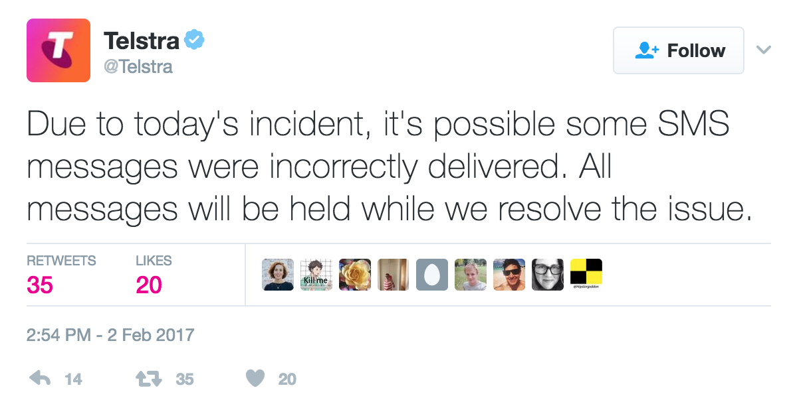
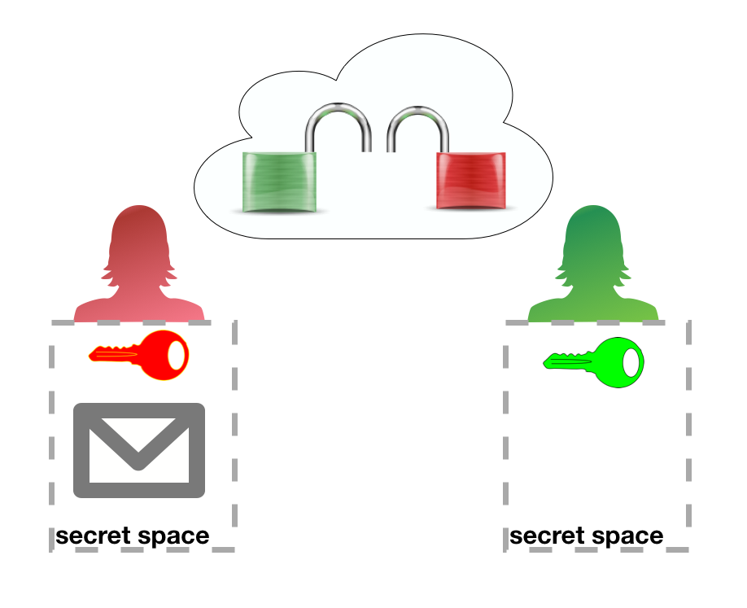
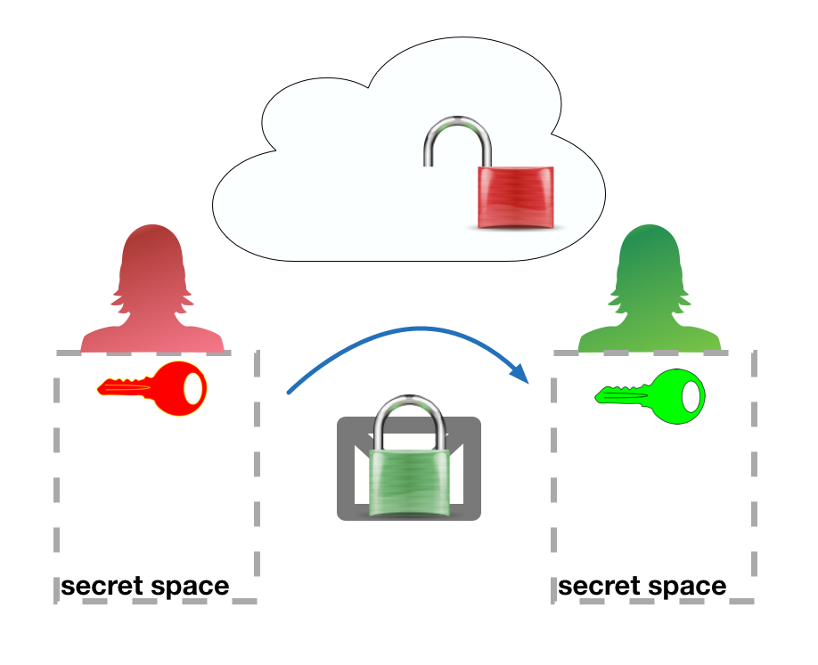
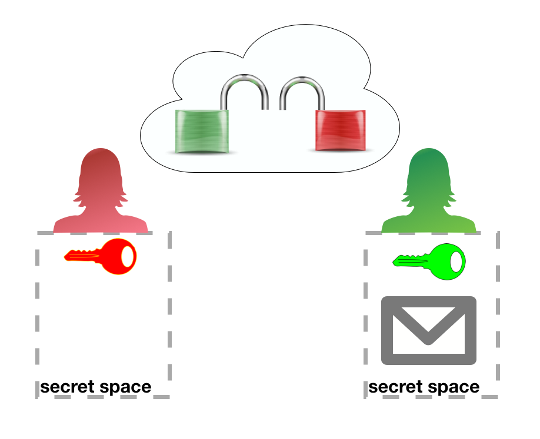

**... but don't forget your keys.**

*(Digital Privacy & Security for Researchers)*

QUT DMRC Summer School 2017

Brenda Moon & Felix Victor Münch

<font size=0.5>image: http://blog.serverfault.com/files/2016/02/encrypt-all-the-things1.png
(based on original by http://hyperboleandahalf.blogspot.com.au/)
</font>

---

# Why are we here?

Note:
* Over the next 2 hours we are going to explore common security and privacy concerns for researchers & some solutions to them.
* To get started thinking about security & privacy let's run through a few examples.
* use of coloured stickynotes - red one: help, green one: finished activity.
* asking questions
----

## Metadata retention

*The Assignment*

You, a young data analyst for the Australian police, are on the train heading home when your phone starts buzzing. You got a text from your boss, who is asking you to take a look at your work emails. You reluctantly open your mailbox only to find the following email:

Notes:
* imagine you're a police agent

----

```txt
From: Finn Coburn <finn.coburn@thepolice.com> To:
data-analysts@thepolice.com Date: 2016-12-10 10:58 Subject:
Fixing a leak at Minecorp

Good morning analysts,

[...]

It seems there is a whistleblower at Minecorp leaking to a
journalist at MineWatch.

[...]

May I remind you that the mines in Australia are all
critical infrastructure, [...]. Therefore, we need
to identify the person of interest to put him/her under
arrest.

So I need you to dig this guy up for me. [...]

All logs you will need for the investigation should be
available on Kibana. You will need to solve the preceding
tasks before moving on to the next.

Do not forget to have a look on the Kibana cheat sheet that
Sharon put together last week for us.

Keep me updated and let me know if you get stuck. I need the
info to be submitted here by no later than 2:30 pm.

FINN COBURN CHIEF DATA OFFICER COMPUTER CRIME SQUAD Tel:
16131 www.thepolice.com
```

https://snitchhunt.org/challenge

Note:
* One example of a privacy and security risk faced by everyone, not just researchers is the retention of metadata and the unexpected ways in which it can be used.
* Would any of you like to suggest a definition of metadata?
* Metadata is activity records - records of what you have done and when, but not the content of what you have done.

FIXME: spread over two slides instead of scrolling

----


(http://www.abc.net.au/triplej/programs/hack/how-team-of-pre-teens-found-whisteblower-using-metadata/8113668)

Note:
* Snitchhunt is a game designed by Gabor Szathmari of CryptoParty Sydney to demonstrate how metadata that is kept on every one of us can be used to track our movements.
* The original website has been taken down but Rosie Williams (@info_aus) has made a new online version (link included in resources at the end of this presentation)
HANDOVER

----

# worst case scenarios

----

## weak password reuse

your Twitter accounts is hacked by angry gamergaters, and suddenly your devices are wiped

----

### Activity

Visit https://haveibeenpwned.com/ and look up your most used email address.

Note:
* FIXME: Define pwned - 'Owned'
* demo first on our own account.
* now go ahead and check your email

----

## revealing IP address

researching in extremist bulletin boards/social networks
getting harassed in your neighbourhood afterwards

----

## unencrypted communication

communication with protesters in an authoritarian surveillance state via iMessage but message gets sent via SMS service

----

## unencrypted devices

interview with journalist in country oppressing the press with 'off-the-record' content on unencrypted Android phone gets confiscated at the airport before leaving the country.

Note:
* even if something similar might have happened, all examples are made up
* also: Felix's stolen hard drive
* 15 minutes in!

---

# Group activity!

----

# Why are you here?

What do you want to get out of this session?
What privacy or security issues might effect your research?
Discuss in groups (5 minutes)

Note:
* break into groups
* discuss what privacy or security issues might effect your research & summarise on butchers paper
* each group report back

---

# Passwords
one ring to rule you all

----

## Main risks

When you've been pwned:

* common password (qwerty, 12345, monkey, love, ...) <!-- .element: class="fragment" -->
* easy to guess (qwerty12345, your name, your birthday, your partners birthday, your postcode, ) <!-- .element: class="fragment" -->
* reuse of passwords <!-- .element: class="fragment" -->
* storing password in an unsafe place (i.e. unencrypted and accessible from outside) <!-- .element: class="fragment" -->
* forgetting your password <!-- .element: class="fragment" -->

Note: 25 minutes in!

----

## Solution #1:

### Use a password manager

Note:
QUESTIONS:
* Who is using a password manager?
* Which one?

----

## What is a password manager?

* allows you to access all your passwords with a master password and/or keyfile ("secret file", e.g. on a USB stick) <!-- .element: class="fragment" -->
* stores passwords in an encrypted file (i.e. not readable without a key) <!-- .element: class="fragment" -->
* can often generate secure passwords for you <!-- .element: class="fragment" -->

Therefore your passwords will be strong, will not be reused, and you don't have to worry about memorising them anymore. <!-- .element: class="fragment" -->

----

## We recommend

* KeePass, KeePassX, KeeWeb
    * Open source +
    * interoperable +
    * high reputation +
    * free +
    * not so convenient -
* 1Password
    * high reputation +
    * very convenient +
    * costs money -
    * closed source -

Note:
* links to all these are provided on the resources page at end of presentation
* not to much detail
HANDOVER

----

## Solution #2:

### Use 2-factor authentication

----

## What is 2-factor authentication?

* comparable to one time passwords for online banking (TAN = transaction authentication number)<!-- .element: class="fragment" -->
* requires a second form of authentication additionally to a password <!-- .element: class="fragment" -->
* this second element changes over time<!-- .element: class="fragment" -->
* most secure forms of this are bound to a device you carry with you, e.g. an app on your phone, or even more secure on a dedicated device<!-- .element: class="fragment" -->
* most major internet services have it, if not this might be a warning sign<!-- .element: class="fragment" -->

----

## SMS is not a secure channel!



Note:
* Last week Telstra (Australian telecom provider) outage caused by fire in Sydney exchange resulted in many SMS's being delivered to wrong phones

----

## SMS problems

* misdelivery
* unauthorised phone number porting
* not available during phone outages
* not encrypted

Note:
* There has been examples in news lately of people repeatedly having their umbers ported just using their name and DOB as authorisation
* Same Telstra outage last week stopped people receiving SMS for 2FA

----

## We recommend

Use an app for 2 factor authentication:

* [FreeOTP](https://freeotp.github.io/)
* [Google Authenticator (Android/iPhone/BlackBerry)](https://support.google.com/accounts/answer/1066447?hl=en)
* [Amazon AWS MFA (Android)](https://www.amazon.com/gp/product/B0061MU68M)
* [Authenticator (Windows Phone 7)](https://www.microsoft.com/en-us/store/p/authenticator/9wzdncrfj3rj)

----

# Group activity!

Find out whether one of your most used services provides 2-factor-authentication

Note:
* break into groups
* check if service supports 2fa & summarise on butchers paper
* each group report back

---

# Communication

----

## Main risks

While transmitting sensitive information: the men in the middle

* others in open/untrusted WiFi <!-- .element: class="fragment" -->
* your email/messaging provider or anybody who has hacked or pretends to be them <!-- .element: class="fragment" -->
* authorities who subpoena any of your communication providers <!-- .element: class="fragment" -->

Note:
FIXME: Show symbol for unsecured WiFi
Email is like a postcard, even the post office can read it
HANDOVER

----

## Solution #1:

### https

Note:
FIXME: maybe up to communication?

----

## What is https?

* browser checks whether website has a valid certificate ('ID card')
* encrypts traffic between browser and website

----

## We recommend

* check the address bar in your browser
* https://www.eff.org/https-everywhere


Examples for bad certificates: https://badssl.com/

----

## Solution #2:

### PGP encryption

"Pretty Good Privacy"

----

## What is PGP encryption?

Encryption protects your information so that no one except the intended recipient can read it.

PGP adds two extra features using a Public key

* it allows you to encrypt information for a recipient without contacting them first - using their Public key
* you can verify that information signed by them is from them

----

## We recommend

* [keybase](https://keybase.io/)
* [GPGTools](https://gpgtools.org/)
* [Enigmail for Thunderbird](https://www.enigmail.net/index.php/en/)
* lots of mail clients have GPG support

----

# Group activity!

Get an account on [keybase.io](https://keybase.io) and encrypt a message to somebody else in this workshop. Send it to their email address. Decrypt a message that someone sends you.

Note:
* FIXME: I think we need to add screenshots & instructions for this? Or demo it - need a slide for the demo then I think.
* FIXME: Explain about verifying that the key belongs to who you think it does - need to do this more thoroughly for more critical communication - keysigning
* FIXME: multiple keys if you want to be able to read it later put your own key on it.

----


----


----


----


----


----


----


----


----


----


----


----


----


----


----

## Whoot! What did just happen?

Let's call the public key a 'padlock'.

----

Red has a secret message for Green



----

Red encrypts message with Green's public padlock


----

Sent message is unreadable without Green's secret key



----

Green decrypts the message with their secret key


----

Done :)



----

## And how does signing work?

That's where the metaphor stops working. Ask later :)

----

## Solution #3:

### Secure messenger / Private messaging

----

## What is a secure messenger?

* encrypts message end-to-end per default (i.e. messages are only readable by sender and recipient, not by the message service provider)
* explicitly does not store activity records (metadata)
* is open source
* optional: has self-destructing messages (i.e. messages are deleted on both ends after a pre-defined timespan)

----

## We recommend

[Signal](https://whispersystems.org/)

Note:
* make sure you confirm that you are speaking to who you expect to be at the other end, and that the encryption is working properly before you exchange any confidential information.

---

# Researcher privacy

----

## Main risks

when researching on the internet:

* activity record (metadata) retention (by state/institution/ad networks)
    * by IP address (like a 'phone number' for your computer)
    * by browser cookies (like customer cards in shops, just for your browser)
* revealing of personal details to website owners
* other forms of browser finger printing

Note:
* your IP address may reveal your location, and stays the same at least during a single session, and possibly all the time. This means it can be used to track your visits across multiple websites
* browser cookies are stored on your computer and used to customise your experience of a website, but can also be used to track your use of a website and even between websites.
* if you login to a website you have provide your account details to that website and to your IP address
* new ways of identifying website visits are always being explored, for example using which fonts your browser reports as a finger print to identify your browser.

----

# Activity!

visit https://browserleaks.com

Note:
* QUESTION: Any surprises?

----

## Solution #1:

### Virtual Private Network
### VPN 'tunnel'

----

## What is a VPN?

* prevents eavesdropping, e.g. in an open WiFi
* hides your IP address (i.e. location, internet provider, other visited websites) from servers you communicate with
* can make you appear to be in another country and circumvent DNS or geo-blocking
* does NOT replace https

----

## We recommend

Choose a VPN service which:

* claims not to store activity records (hard to verify)
* uses OpenVPN
* has servers in safe jurisdictions
* not insert advertising into your browsing stream

Remember that if it's too cheap you might be paying in other ways.

[NordVPN](https://nordvpn.com/) and [Private Internet Access](https://www.privateinternetaccess.com/) both have a long term high reputation

----

## Solution #2:

### Tor Browser

----

## What is Tor Browser?

* provides secure browser that doesn't leave traces (e.g. it does not store cookies)
* onion-network (encrypted tunnel through encrypted tunnel through encrypted tunnel ...)
* does not prevent you from disclosing your identity e.g. by logging into Facebook

----

## We recommend

Use for high risk research, not for everyday use.

----

# Group activity!

Install Tor Browser and visit https://browserleaks.com again.

Tor Browser: https://www.torproject.org/projects/torbrowser.html.en

Note:
* Explain about using signatures to verify downloads?
* What did you find was different in browserleaks report?
HAND OVER

---

# Data storage

----

## Main risks

when storing data:

* unauthorised access to data, e.g. in the cloud
* unwanted access to devices, e.g. at airports
* data loss
* lost access

----

## Solution

----

# backup, backup, backup

3 independent copies

Note: research storage - QUT provides properly tape backed up storage for research data (rstore).

----

AND

----


**... but don't forget your keys.**
*(hint: use a password manager)*

----

## We recommend

* full device/disk/USB stick … encryption (mostly provided by OS)
* for files in the cloud:
    * [Cryptomator](https://cryptomator.org/)
    * [keybase](https://keybase.io/)
    * disk image encryption by your operating system

MAKE SURE YOU NEVER LOOSE YOUR KEYS OR PASSPHRASES!!! Or all will be lost.

Note:
* Most encryption services offer multiple ways of storing your keys or passphrases - take advantage of them, but make sure you store the keys or passphrases securely.

Note: HAND OVER

---

# How to choose a tool?

----

1. Open Source?<!-- .element: class="fragment" -->
2. Reputation?<!-- .element: class="fragment" -->
3. Independent security audit?<!-- .element: class="fragment" -->
4. Will you actually use it?<!-- .element: class="fragment" -->

---

# Where to from here?

At end of the presentation there is a list of all the software we've mentioned today and a list of useful websites for more information.

Depending on the level of risk to you or your research participants you may need to seek advice from a security/privacy expert before you begin your research.

Note:
* Risks/Solutions are changing over time, so important to get current advice before you start your research.
* FIXME: something from earlier...

---

# Group activity!

Discuss in your groups how what we have covered today applies to your research.

---

Questions?

---

# Resources

----

## Password manager

* 1Password https://1password.com/
* KeePass http://keepass.info/
* KeePassX https://www.keepassx.org/
* KeeWeb https://keeweb.info/

----

## 2-factor-authentication

* Amazon AWS MFA (Android) https://www.amazon.com/gp/product/B0061MU68M
* Authenticator (Windows Phone 7) https://www.microsoft.com/en-us/store/p/authenticator/9wzdncrfj3rj
* FreeOTP https://freeotp.github.io/
* Google Authenticator (Android/iPhone/BlackBerry) https://support.google.com/accounts/answer/1066447?hl=en

----

## Privacy

* Browser leaks https://browserleaks.com
* HTTPS Everywhere https://www.eff.org/https-everywhere
* NordVPN https://nordvpn.com/
* Private Internet Access https://www.privateinternetaccess.com/
* Tor Browser: https://www.torproject.org/projects/torbrowser.html.en

----

## file/device/communication encryption

* Cryptomator https://cryptomator.org/
* Enigmail for Thunderbird https://www.enigmail.net/index.php/en/
* GPGTools https://gpgtools.org/
* keybase https://keybase.io/
* Signal https://whispersystems.org/

----

## websites

* CryptoParty https://www.cryptoparty.in/
* Electronic Freedom Foundation (EFF)
  * Privacy https://www.eff.org/issues/privacy
  * Surveillance Self-Defense https://ssd.eff.org/
    This has overviews, tutorials, and detailed guides for specific situations.
* Snitch Hunt Game http://whistleblower.network/snitch/index.php

---

# Glossary of terms

* browser cookies: like customer cards for your browser to store information about you that can be read by the website when you return
* encryption: making data practically unreadable without another piece of data (see keyfile) and/or password that's usually kept secret
* end-to-end encryption: encryption from a senders device to a recipient device without intermediaries being able to decrypt

----

# Glossary of terms

* https: HTTP over SSL https://en.wikipedia.org/wiki/HTTPS
* IP address: number to identify your computer/router to another computer, mostly a server serving you a website
* keyfile: think of it as a password, but in a file.
* metadata: activity records (https://twitter.com/Snowden/status/661305566967562240) or more detailed: https://ssd.eff.org/en/glossary/metadata
* ssl or tsl: Secure Sockets Layer / Transport Layer Security https://en.wikipedia.org/wiki/Transport_Layer_Security

---


@brendam
@flxvctr

QUT DMRC Summer School 2017
